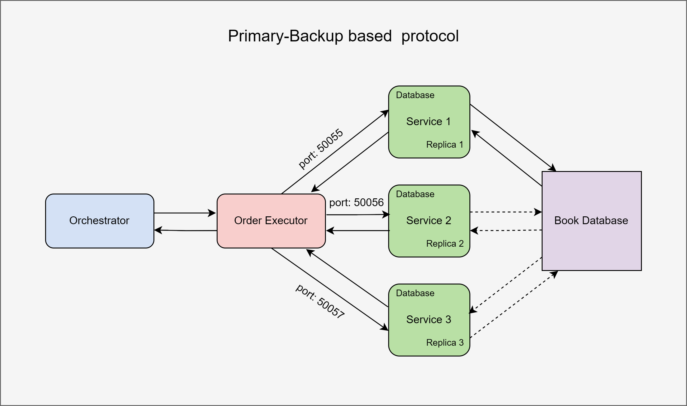
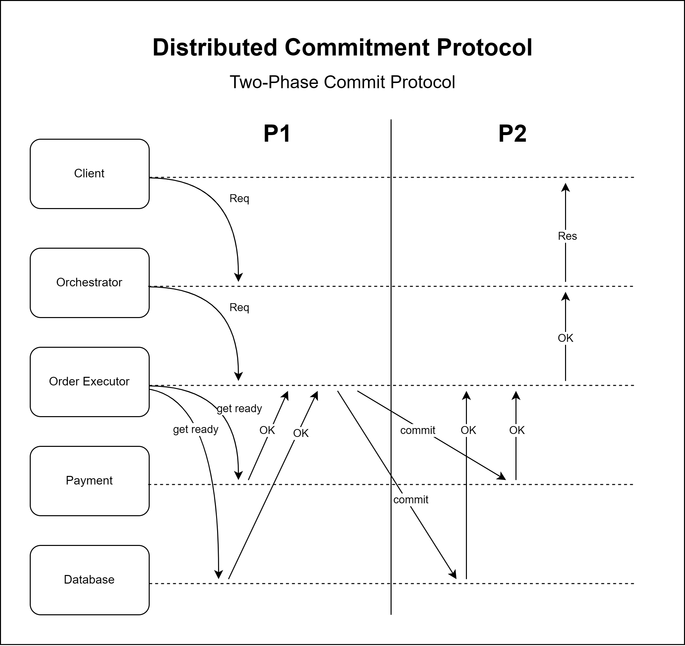

# Documentation

### Consistency Protocol

### Distributed Commitment Protocol

### Frontend

UI of the app - the point where users are expected to interact with.

### Orchestrator

Initiates 3 worker threads once received request. In the meantime, gRPC requests are sent to the implemented services: Fraud Detection, Transaction verification, and Suggestions. Then, finishes the threads and responds with corresponding response.

## Fraud Detection

Rejects requests from countries that are known for fraudulent activities. 

## Transaction Verification

Verifies based on card number length and numerical characters.

## Suggestions

Sends API request to Google Books and retrieves 3 most relevant books. If no such entities found, can use a static fallback list of books.

## Order Queue

A priority queue that stores incoming orders.

## Order Execution

Group of replicated instances responsible for processing orders from the queue and uses leader election to coordinate.

## Books Database
A replicated key-value store managing book stock. It uses a primary-backup model to stay consistent and participates in two-phase commit (2PC) to ensure stock updates happen only when an order is confirmed. Main tasks: read stock and prepare/commit/abort stock changes.

## Payment
Handles payment processing and also follows the 2PC protocol. It prepares, then commits or cancels a payment based on the order outcome to ensure payments go through only if the order is fully successful.

